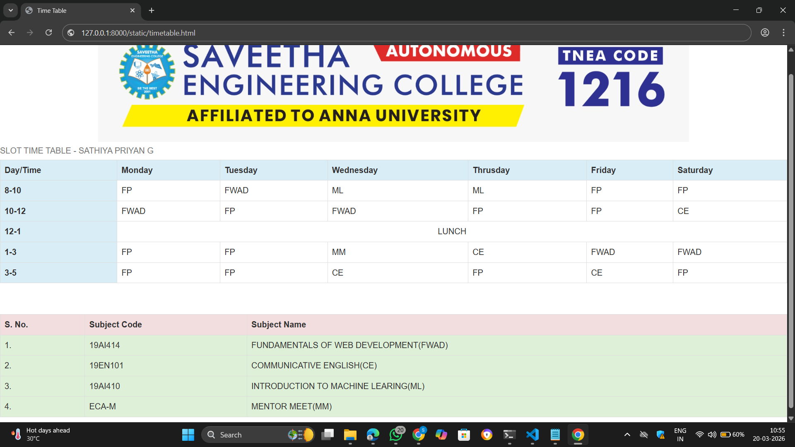

# Ex08 CAMU Schedule using Bootstrap
## Date:20.3.26

## AIM:
To design a responsive and visually appealing CAMU Schedule using Bootstrap.

## DESIGN STEPS:

### Step 1:
Clone the repository from GitHub.

### Step 2:
Create Django Admin project.

### Step 3:
Create a New App under the Django Admin project.

### Step 4:
Add the Bootstrap CDN link inside the ```<head>``` section.

### Step 5:
Insert a table element with Bootstrap table classes.

### Step 6:
Construct the complete table.

### Step 7:
Add a header/footer displaying copyright information.

### Step 8:
Publish the website in the LocalHost.

## PROGRAM :
~~~
<html>
    <head>
        <title>Time Table</title>
        <link rel="stylesheet" href="https://maxcdn.bootstrapcdn.com/bootstrap/3.4.1/css/bootstrap.min.css">
        <script src="https://ajax.googleapis.com/ajax/libs/jquery/3.7.1/jquery.min.js"></script>
        <script src="https://maxcdn.bootstrapcdn.com/bootstrap/3.4.1/js/bootstrap.min.js"></script>
    </head>
    <body align="center">
        
<table class="table table-bordered table-hover">
<caption>SLOT TIME TABLE - SATHIYA PRIYAN G</caption>
  <tr class="bg-info">
    <th>Day/Time</th>
    <th>Monday</th>
    <th>Tuesday</th>
    <th>Wednesday</th>
    <th>Thrusday</th>
    <th>Friday</th>
    <th>Saturday</th>
  </tr>
  <tr>
    <th class="bg-info">8-10</th>
    <td>FP</td>
    <td>FWAD</td>
    <td>ML</td>
    <td>ML</td>
    <td>FP</td>
    <td>FP</td>
  </tr>
  <tr>
    <th class="bg-info">10-12</th>
    <td>FWAD</td>
    <td>FP</td>
    <td>FWAD</td>
    <td>FP</td>
    <td>FP</td>
    <td>CE</td>
  </tr>
  <tr>
    <th class="bg-info">12-1</th>
    <td align="center " colspan="6">LUNCH</td>
  </tr>
  <tr>
    <th class="bg-info">1-3</th>
    <td>FP</td>
    <td>FP</td>
    <td>MM</td>
    <td>CE</td>
    <td>FWAD</td>
    <td>FWAD</td>
  </tr>
  <tr>    <th class="bg-info">3-5</th>
    <td>FP</td>
    <td>FP</td>
    <td>CE</td>
    <td>FP</td>
    <td>CE</td>
    <td>FP</td>
</tr>
</table>
<br>
<br>
<table class="table table-bordered table-hover">
  <tr class="bg-danger">
    <th>S. No.</th>
    <th>Subject Code</th>
    <th>Subject Name</th>
  </tr>
  <tr class="bg-success">
    <td>1.</td>
    <td>19AI414</td>
    <td>FUNDAMENTALS OF WEB DEVELOPMENT(FWAD)</td>
    </tr>
  <tr class="bg-success">
    <td>2.</td>
    <td>19EN101</td>
    <td>COMMUNICATIVE ENGLISH(CE)</td>
  </tr>
  <tr class="bg-success">
    <td>3.</td>
    <td>19AI410</td>
    <td>INTRODUCTION TO MACHINE LEARING(ML)</td>
    <tr class="bg-success">
    <td>4.</td>
    <td>ECA-M</td>
    <td>MENTOR MEET(MM)</td>
  </tr>
</table>
</body>
</html>
~~~

## OUTPUT:


## RESULT:
A responsive and visually appealing CAMU Schedule web page using Bootstrap is designed successfully.
